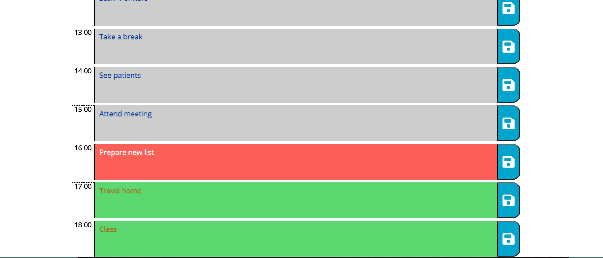

# Day Planner

## User Story

AS a student developer and full-time  employee with a busy schedule, I want to add important events to a daily planner so that I can manage my time effectively.

## Table of Content

* [Motivation](#motivation)
* [Description](#description)
* [Requirements](#requirements)
* [Screenshots](#screenshots)
* [Link to Page](#link-to-page)
* [Tools](#tools)

## Motivation

I want to create a day planner application that allows me to keep track of the daily tasks that I have to get done. 

## Description

Create a simple calendar application that allows the user to save events for each hour of the day by modifying starter code. This app will run in the browser and feature dynamically updated HTML and CSS powered by jQuery.

## Requirements 

The day planner application will render the following:

* When I open the planner, then the current day is displayed at the top of the calendar.
* When I scroll down, then I am presented with time blocks for standard business hours.
* WhenI view the time blocks for that day, then each time block is color-coded to indicate whether it is in the past, present, or future.
* When I click into a time block, then I can enter a task.
* When I click the save button for that time block, then the text for that event is saved in local storage.
* When I refresh the page, then the saved events persist.

## Screenshots

## Link to Page

<https://esmendez90.github.io/day-planner/>

## Tools

* Visual Studio Code <https://code.visualstudio.com>.
* Chrome DevTools - Inspect
 